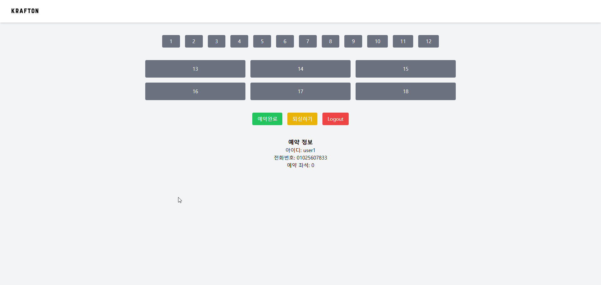
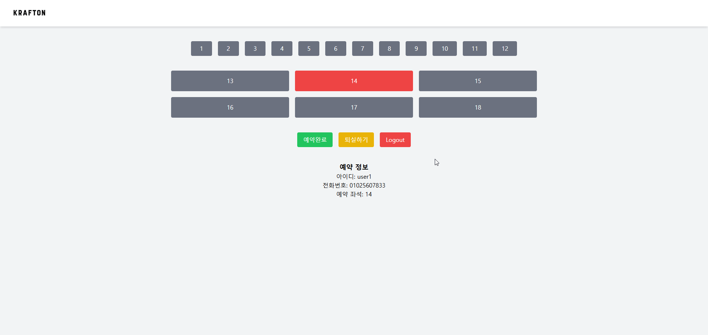
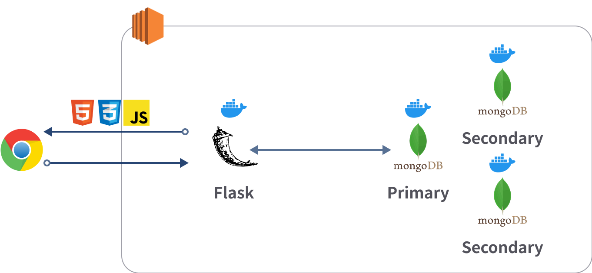
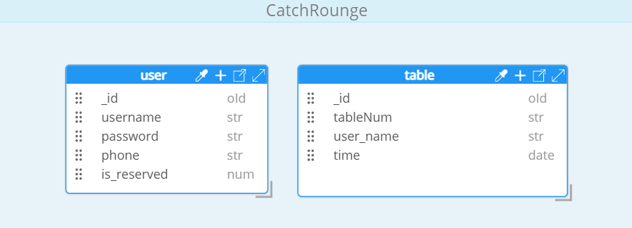

# CatchRounge

## 목차

1. [프로젝트 개요](#프로젝트-개요)
2. [주요 기능](#주요-기능)
3. [기술 스택](#기술-스택)
4. [아키텍처](#아키텍처)
5. [DB 스키마](#DB-스키마)
6. [디렉토리 구조](#디렉토리-구조)
7. [실행 방법](#실행-방법)
8. [API 명세](#API-명세)
9. [프로젝트 회고](#프로젝트-회고)

## 프로젝트 개요
CatchRounge는 부트 캠프 라운지의 제한된 공간을 공정하게 사용할 수 있도록 만든 라운지 예약 관리 시스템입니다.

| 항목       | 내용                                     |
|------------|----------------------------------------|
| 기간       | 24.09.04 ~ 24.09.07(3일)                                 |
| 인원       | 3명                                     |
| 역할       | 김남훈: 기획 및 백엔드 개발 <br>김지훈: UI 담당 <br>김현영: 배포 및 백엔드 개발 |

## 주요 기능
- **좌석 예약/퇴실** : 사용자가 라운지 좌석을 예매하고, 필요 시 직접 퇴실 처리 가능


- **자동 퇴실 기능** : 예약된 시간이 지나면 좌석이 자동으로 해제되어 다른 사용자가 이용 가능




## 기술 스택


| 분야       | 기술                                  |
|-----------|-------------------------------------|
| Backend   | Flask, Python, Jinja2               |
| Frontend  | HTML, CSS, JavaScript             |
| Database  | MongoDB                              |
| DevOps/Infra | Docker                             |

## 아키텍처


## DB 스키마


## 디렉토리 구조

```
 ┣ app
 ┃ ┣ 📂common
 ┃ ┃ ┣ 📂initializer 
 ┃ ┃ ┣ config.py 
 ┃ ┃ ┣ error_handler.py 
 ┃ ┃ ┣ extensions.py 
 ┃ ┃ ┗ jwt_filter.py
 ┃ ┣ 📂repository
 ┃ ┣ 📂route
 ┃ ┣ 📂service
 ┃ ┣ 📂static
 ┃ ┣ 📂templates
 ┃ ┗ __init__.py
 ┣ .DS_Store
 ┣ .gitignore
 ┣ Dockerfile
 ┣ docker-compose.yml
 ┣ init-replica.sh
 ┣ requirements.txt
 ┗ run.py
```

## 실행 방법


💡  Windows + Docker 환경에서 APScheduler 지연 문제가 있으므로 이슈 확인([관련 이슈](https://github.com/southernlight/catchrounge/issues/1)) 

1. 저장소 클론
```bash
git clone https://github.com/southernlight/catchrounge.git
cd catchrounge
```

2. Docker Compose로 컨테이너 실행
```bash
docker compose up --build -d
```

3. 브라우저에서 접속  
[http://localhost:5000](http://localhost:5000)


## API 명세

<details>
<summary>Auth (인증)</summary>

| 기능          | Method | URL     | Request                              | Response                  | 설명                       |
| ----------- | ------ | ------- | ------------------------------------ | ------------------------- | ------------------------ |
| 회원가입 페이지 조회 | GET    | /signup | -                                    | HTML (signup.html)                     | 회원가입 화면 렌더링              |
| 회원가입 처리     | POST   | /signup | form-data: username, password, phone | redirect + flash 메시지      | 신규 회원 가입 처리              |
| 로그인 페이지 조회  | GET    | /signin | -                                    | HTML (signin.html)                     | 로그인 화면 렌더링               |
| 로그인 처리      | POST   | /signin | form-data: username, password        | redirect + accessToken 쿠키 | 로그인 인증 및 토큰 발급           |
| 로그아웃        | GET    | /logout | -                                    | redirect                  | accessToken 쿠키 삭제 및 로그아웃 |

</details>

<details>
<summary>Main (메인 페이지)</summary>

| 기능        | Method | URL | Request | Response         | 설명                                   |
| ----------- | ------ | --- | ------- | ---------------- | ------------------------------------ |
| 홈 화면 조회 | GET    | /   | -       | HTML (main.html) | 로그인 후 메인 페이지 렌더링, 사용자 정보 및 테이블 목록 포함 |

</details>

<details>
<summary>Table (좌석 정보)</summary>

| 기능             | Method | URL                     | Request | Response                                                                                                                                                         | 설명                     |
| ---------------- | ------ | ----------------------- | ------- | ---------------------------------------------------------------------------------------------------------------------------------------------------------------- | ---------------------- |
| 테이블 정보 조회 | GET    | /api/tables/{table_num} | -       | {<br/>&nbsp;&nbsp;"success": true,<br/>&nbsp;&nbsp;"table": {<br/>&nbsp;&nbsp;&nbsp;&nbsp;"tableNum": 1,<br/>&nbsp;&nbsp;&nbsp;&nbsp;"occupied": false,<br/>&nbsp;&nbsp;&nbsp;&nbsp;"user_name": "홍길동",<br/>&nbsp;&nbsp;&nbsp;&nbsp;"time": "10:00:00"<br/>&nbsp;&nbsp;}<br/>} | 특정 테이블 정보 조회 |

</details>

<details>
<summary>Reservation (예약)</summary>

| 기능           | Method | URL            | Request                     | Response                                                   | 설명                         |
| -------------- | ------ | -------------- | --------------------------- | ---------------------------------------------------------- | ---------------------------- |
| 좌석 예약       | PUT    | /api/tables/me | {<br/>&nbsp;&nbsp;"tableNum": 1<br/>} | {<br/>&nbsp;&nbsp;"success": true,<br/>&nbsp;&nbsp;"message": "예약 완료"<br/>}    | 로그인한 사용자의 테이블 예약 |
| 좌석 예약 취소  | DELETE | /api/tables/me | -                           | {<br/>&nbsp;&nbsp;"success": true,<br/>&nbsp;&nbsp;"message": "예약 취소 완료"<br/>} | 로그인한 사용자의 예약 취소  |

</details>

<details>
<summary>WebSocket</summary>

| 기능                      | Event / Method | Request               | Response / Notes      | 설명                                 |
| ------------------------- | -------------- | ------------------- | ------------------- | ---------------------------------- |
| SocketIO 연결 및 Room join | connect        | query param: username | 없음 (연결 후 Room join)   | 클라이언트 접속 시 username 기반 Room에 자동 가입 |
| 메시지 송수신 (예시)       | custom_event   | JSON 메시지 구조 정의 필요 | JSON 또는 broadcast 메시지 | 서버와 클라이언트 간 실시간 데이터 송수신 |

</details>

## 프로젝트 회고

- 짧은 3일 동안 팀원들과 협력하여 성공적으로 결과물을 완성한 팀 프로젝트였습니다.
- 처음 진행하는 프로젝트였지만, 웹 프로그래밍의 전반적인 흐름을 이해할 수 있는 좋은 경험이었습니다.
- 이번 프로젝트를 통해 다음과 같은 웹 서비스 기초 기술을 학습할 수 있었습니다:
  - CSR(Client-Side Rendering) / SSR(Server-Side Rendering) 이해
  - JWT(Json Web Token)를 활용한 인증 및 권한 관리
  - 데이터베이스 설계 및 CRUD 처리
  - 전체적인 웹 서비스 아키텍처 이해
